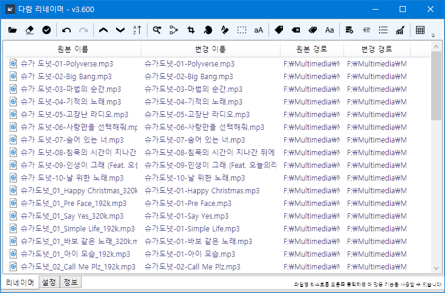

# Daram Renamer [](https://shields.io)

Files and Directories Renaming application.

"다람 리네이머" and "Daram Renamer" is official conventions.



## Requirements
* .NET Framework 4.7.2+
* Windows 7+*
* Direct3D 9 Compatible GPU**

## Translation
Daram Renamer currently support Korean(Republic of Korea) and English. but I want to more language supports.

You can support translation if you follow this process.

1. Fork this repository.
2. Edit ```Daramkun.DaramRenamer/Strings.json```. Use [String Table Editor](https://github.com/daramkun/StringTableEditor) for easier.
3. Pull request to this main repository(https://github.com/daramkun/DaramRenamer).
4. I confirm request.

## Plans
* Windows Explorer integration(Context menu).
* Porting to Universal Windows Platform.
* Porting to GTK+ for Linux.
* Porting to Xamarin.Mac for macOS.
* Porting to Xamarin.Droid for Android.
* Support GUI Batch script.
* Compressed File(ZIP, RAR, ...)'s File and Directory support.
* User Custom Rename Plugin support.

---
* ＊ I recommend Windows 10 because My Development environment is Windows 10 April 2018 Update now.
* ＊＊ Windows Presentation Foundation(WPF) need Direct3D 9 compatible device.
