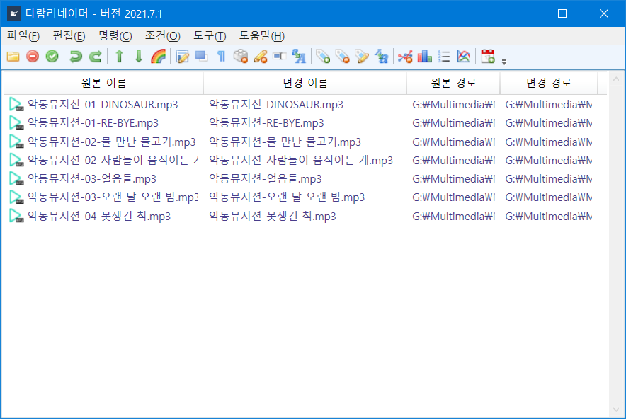

# 다람리네이머
`다람리네이머`는 파일 이름을 일괄적으로 변경하는 응용프로그램입니다.

## 요구사항
- `.NET6` 또는 그보다 최신 버전
- `Windows 7` 또는 그보다 최신 버전
  - `Windows 11 21H2`를 추천

# DaramRenamer
`DaramRenamer` is application program for batched filename change.

## Requirements
- `.NET6` or newer
- `Windows 7` or newer
  - Recommended `Windows 11 21H2`

----
## 스크린샷 (Screenshots)

